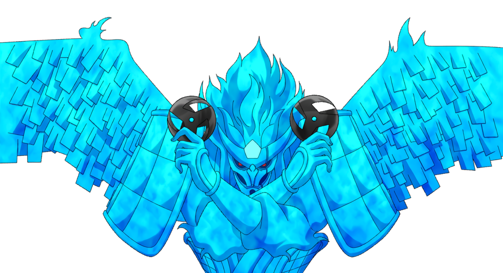

# About Me
👋 Hi, I’m Keshav Locknauth aka **0xkakashi**, a passionate cybersecurity professional.

🌱 My interests span across the vast realm of IT, with a keen focus on Cyber Security. I love learning and exploring new technologies. I actively compete in various Capture The Flag (CTF) competitions with my team, **konohagakure**. You can find out more about us on our [CTFtime profile](https://ctftime.org/team/309244)

💻 My tech journey has equipped me with a robust skill set in web development and programming. I’ve worked with technologies including HTML, CSS, JavaScript, TypeScript, Tailwind CSS, React, PHP, Firebase, SQL, NoSQL, MongoDB, Python, C, Java, C++, Flask, and Django. This diverse knowledge allows me to integrate security with development seamlessly.

🌟 Beyond cybersecurity and coding, I’m constantly exploring new technologies and staying updated with the latest industry trends.

🌀 I am a big fan of Naruto, especially **Kakashi Hatake**. Kakashi's dedication, resilience, and strategic thinking are a huge source of inspiration for me. His ability to overcome challenges with determination and skill motivates me to approach my own endeavors with the same level of commitment and creativity. Kakashi’s journey reminds me to stay focused, adapt, and never stop learning, qualities that I strive to embody in both my personal and professional life.🥷

📫 Feel free to connect with me on [LinkedIn](https://www.linkedin.com/in/keshav-locknauth/) or reach out via [email](mailto:keshav.locknauth@hotmail.com).

